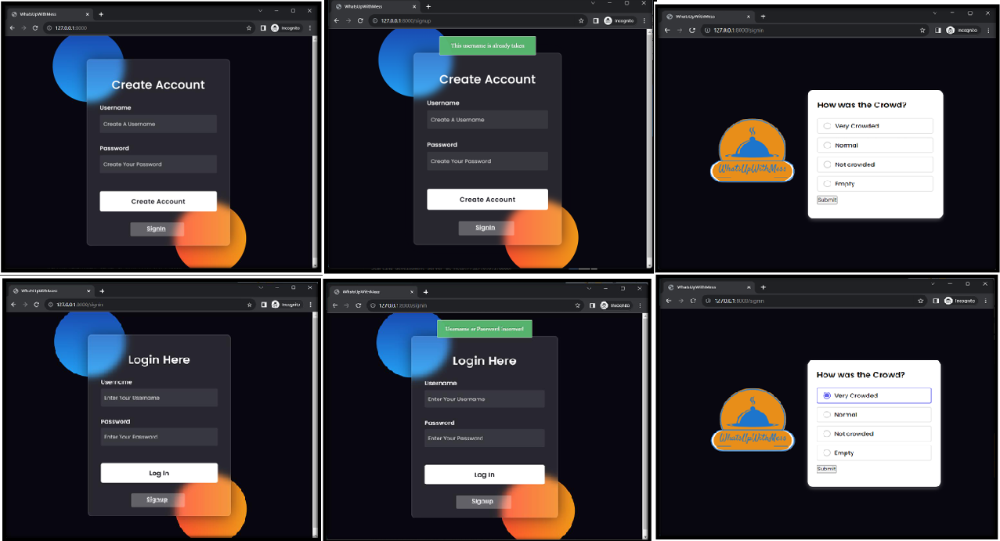

# WhatsUpWithMess

A dynamic, web-based mess status polling system built with the Django framework. This application provides a real-time platform for students to vote on and view the current conditions of their college mess.




## About The Project

WhatsUpWithMess is a web application designed to solve the common challenge of managing and communicating the daily status of college mess facilities. The current lack of a centralized system often creates hurdles in maintaining a satisfactory food service for students.

This project addresses the issue by creating a platform where students can vote on current mess conditions, such as crowd levels, and view real-time results. This allows users to make informed decisions about when to visit the mess, creating a more responsive and satisfactory food service experience. The application is built using the Django framework for seamless integration and user-friendly interaction.

### Key Features

* **User Authentication**: Secure signup, login, and logout functionality for all users. The system can handle new account creation and checks for existing usernames to prevent duplicates.
* **Dynamic Polling System**: An interactive interface allowing users to cast votes on mess conditions. The primary poll implemented asks users, "How was the Crowd?" with options ranging from "Very Crowded" to "Empty".
* **Real-Time Results**: Instantly updated poll results are displayed to all users, providing immediate feedback on the current situation in the mess.
* **Responsive Frontend**: A clean and user-friendly interface built with HTML, CSS, and JavaScript, ensuring ease of use and efficient navigation.

## Built With

This project leverages a modern web development stack:
* [Django](https://www.djangoproject.com/)
* [Python](https://www.python.org/)
* HTML
* CSS
* JavaScript

## Getting Started

To get a local copy up and running, follow these simple steps.

### Prerequisites

Make sure you have Python and pip installed on your system.
* python
* pip

### Installation

1.  Clone the repo
    ```sh
    git clone [https://github.com/your_username_/WhatsUpWithMess.git](https://github.com/your_username_/WhatsUpWithMess.git)
    ```
2.  Navigate to the project directory
    ```sh
    cd WhatsUpWithMess
    ```
3.  Install Django
    ```sh
    pip install django
    ```
4.  Apply database migrations
    ```sh
    python manage.py migrate
    ```
5.  Run the development server
    ```sh
    python manage.py runserver
    ```
6.  Open your browser and go to `http://127.0.0.1:8000/`

## Usage

The application provides a simple and intuitive workflow for users:

1.  **Create an Account:** New users can sign up with a unique username and password on the account creation page.
2.  **Login:** Existing users can log in to the system to access the polling system. The system validates credentials and shows an error for incorrect entries.
3.  **Vote:** After logging in, users are directed to the main polling page where they can cast their vote on the current mess conditions.
4.  **View Results:** The application processes the vote and displays the collective results in real-time, showing the total votes for each option.

## Project Author

This project was created by **Vedant Tiwari** for the Programming for Problem-Solving (21CSS101J) course at SRM Institute of Science & Technology.